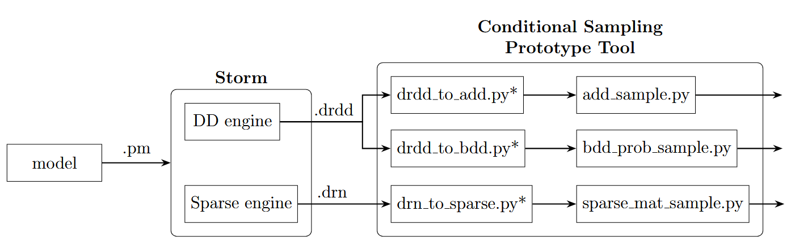

## *MCCS: Markov Chain Conditioned Sampling*

This repository features three realisations of an algorithm which generates sample traces of specified length of an input Markov chain, and meet provided initial and end conditions.
It was implemented as part of my MSc thesis research.

The realisations are based on different data structures - Algabraic Decision Diagrams (ADDs), Binary Decision Diagrams (BDDs) and sparse tensor.

### Pipeline usage 



Default usage meant for [Prism](https://www.prismmodelchecker.org) DTMC models, like those found in the `examples` folder. The set of initial states is assumed from the model, targeted states must be assigned a label.

**Model processing** requires [Storm](https://www.stormchecker.org/index.html), and is performed by the commands
```Bash
storm --prism dice.pm --buildfull --prismcompat --engine sparse --exportbuild dice.drn
storm --prism dice.pm --buildfull --prismcompat --engine dd --exportbuild dice.drdd
```
Notice the usage of different `--engine` options depending on desired output type: `sparse` for `drn` (matrices), and `dd` for `drdd` (ADD/BDD). Constants assignments can be passed as parameters, for example for `N` and `MAX` use `--constants N=16,MAX=2`.

Some processed files have been provided in the `example` folder for convenience.

**Script usage** of the sampling modules `x_sample.py` is largely the same across implementations, and argument help (`-h`) is provided.

```
python  sparse_mat_sample.py -h
usage: Generates conditional samples of system via sparse matrices.
       [-h] [-repeats REPEATS] [-tlabel TLABEL] [-output OUTPUT] [--store]
       fname length
positional arguments:
  fname             Model exported as drn file by storm
  length            Generated trace length

options:
  -h, --help        show this help message and exit
  -repeats REPEATS  Number of traces to generate
  -tlabel TLABEL    Name of target label matching desired final states
  -output OUTPUT    File destination for generated traces
  --store           Store / try loading existing mats
```

And example usage:
```
python add_sample.py robot.drdd 32 -repeats 100 -output robot.drdd.out
```


### Direct usage